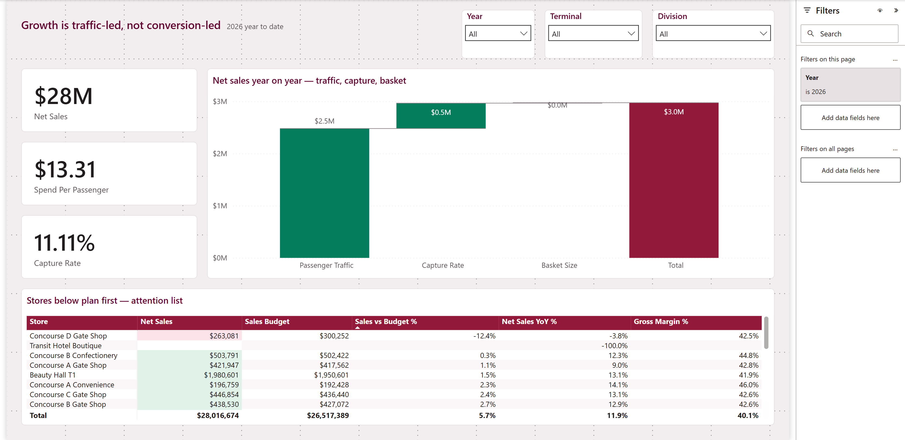
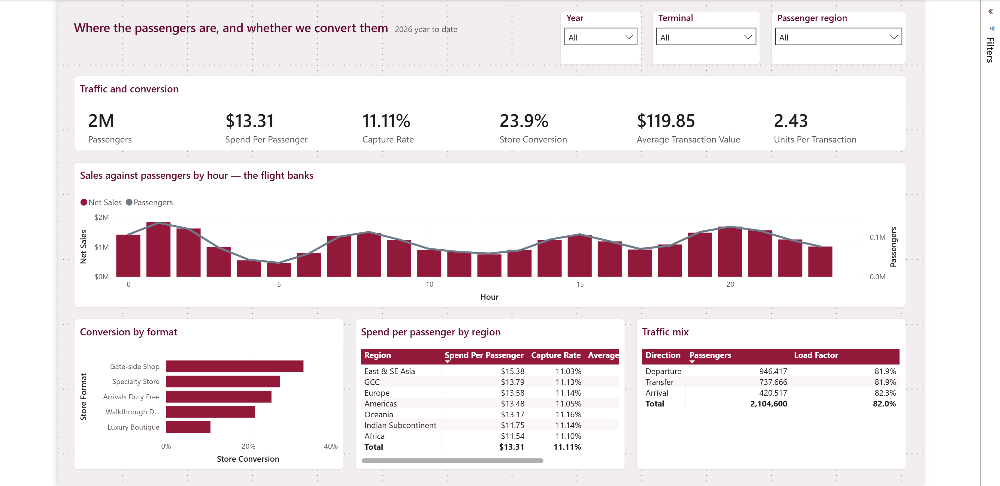
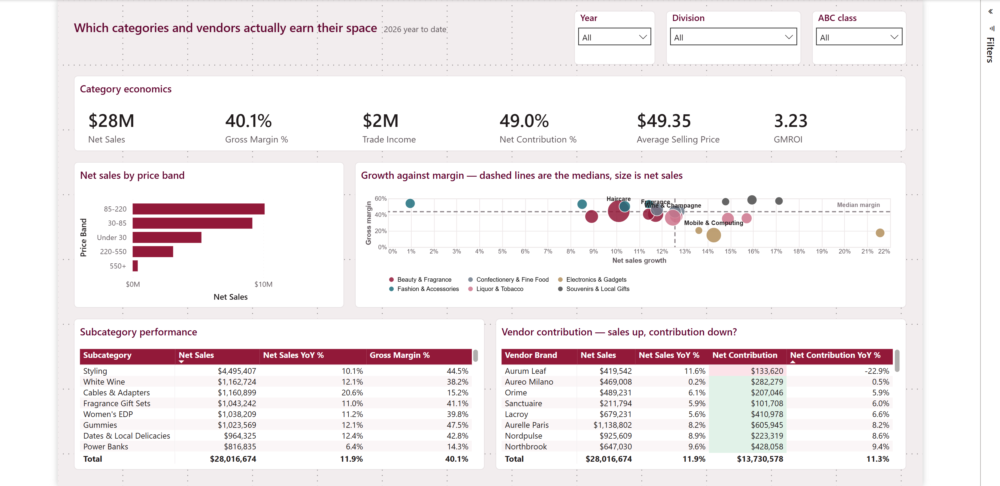
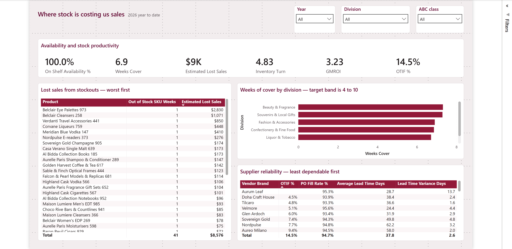

# Project Background

Modelio is an airport travel-retail operation running 25 outlets across two terminals and five concourses. The estate covers six divisions: Beauty & Fragrance, Liquor & Tobacco, Confectionery & Fine Food, Fashion & Accessories, Electronics & Gadgets, and Souvenirs & Local Gifts. Formats range from a 3,200 m² walkthrough duty free to 130 m² gate-side convenience units. Trading data runs from January 2023 to August 2026, and the business is mid-way through moving its reporting from AX Dynamics to R3.

Travel retail does not behave like high-street retail, and the difference sets the whole analytical frame. Sales are a function of how many passengers pass a store, what share of them transact, and what each buyer spends. Written as an identity:

```
Net Sales = Passengers x Capture Rate x Average Transaction Value
```

Passenger volume is handed to the retailer by the airport. Capture rate and basket value are the two levers the retailer actually controls. Any commentary that reports sales growth without separating those three is describing weather rather than performance.

This analysis covers 2026 year to date (January to August) against the same period in 2025 and against budget, and is written for the Category Managers, Operational Managers and Marketing team who own the decisions, and for the senior management group who sign off investment.

Insights and recommendations are provided on the following key areas:

- **Growth quality:** whether the year-to-date result came from passenger volume or from anything the retail business did.
- **Passenger mix and conversion:** which nationalities and store formats convert, and where the estate is leaving money on the floor.
- **Category and vendor profitability:** which categories earn their space, and where reported margin hides a contribution problem.
- **Availability and supply reliability:** stock cover, lost sales from out-of-stocks, and supplier dependability.

---

# Data Structure & Initial Checks

The model is a star schema of 17 tables and 26 relationships holding 1,782,646 sales lines. The seven tables that carry the analysis:

- **Sales:** transaction-line grain. 1,782,646 rows after cleaning, covering value, cost, vendor rebate, promotion, tender currency and passenger nationality.
- **Passenger Traffic:** date, hour, terminal, direction and region grain. 1,298,086 rows. This is the denominator for every headline metric.
- **Inventory:** weekly stock snapshot at store and SKU grain, 781,824 rows, used for cover, availability and GMROI.
- **Budget:** monthly plan at store and division grain.
- **Purchase Orders:** 16,485 PO lines with promised against actual receipt dates, used for fill rate, OTIF and lead-time variance.
- **Product / Store / Vendor:** the dimensions carrying category hierarchy, format and trading area, and supplier trade terms.
- **Store Footfall:** door-counter entries by store and hour, used for conversion.

Three conformed dimensions do the heavy lifting. Passenger Region relates to both Sales and Passenger Traffic, so a region filter moves the numerator and the denominator together. Without it, spend per passenger by nationality returns nonsense. Division relates to both Product and Budget, because plan is held at division level while product sits at SKU level. Hour of Day relates to Sales, Passenger Traffic and Store Footfall, all three of which carry their own hour column with no link between them.

Initial checks found five data issues that had to be resolved before any number could be trusted:

| Check | Finding | Treatment |
|---|---|---|
| Duplicate records | 4,222 rows duplicated across 1 to 3 April 2026 | Removed on the unique line key. Sales in that window were overstated by 100% before cleaning. |
| Orphan product keys | 169 sales rows carrying SKUs absent from the product master | Quarantined and reported, not silently dropped |
| Mixed currency | 8% of transactions tendered in EUR and recorded in EUR | Converted at load, so no measure mixes currencies |
| Missing nationality | 8% of lines | Retained as unknown rather than imputed |
| Returns | 1.5% of lines carry negative quantity and value | Retained. These are genuine business events and filtering them overstates net sales. |


---

# Executive Summary

### Overview of Findings

Net sales for 2026 year to date are $28.0m, 5.7% ahead of budget and 11.9% ahead of last year. On the face of it that is a good year. Decomposing the movement changes the reading: of the $2.98m increase, $2.48m came from passenger growth the airport delivered, $0.49m from a better capture rate, and $8,135 from basket size. Roughly 83% of the growth was handed to the business rather than earned by it.

Average transaction value is flat year on year at $119.85. Two full years of category work, promotional activity and range change have moved basket value by 0.3%. If passenger growth flattens next year, so does the top line.

Two specific problems sit underneath the aggregate. Concourse D Gate Shop is 12.4% below plan and down 3.8% on last year while its terminal's traffic grew, and one vendor is growing sales 11.6% while its contribution to the business falls 22.9%.


[Link to Live Dashboard](https://app.powerbi.com/groups/me/reports/2e5ab5c2-bdba-4c48-9860-752470924a02/executive360?experience=power-bi)

---

# Insights Deep Dive

### Growth quality

* **Passenger volume produced 83% of the year-to-date sales increase.** Net sales rose $2,975,612 against the same period last year. Splitting that movement across the three drivers gives $2,480,942 from passenger traffic, $486,531 from capture rate, and $8,135 from basket size. The three figures reconcile to the total to within $3, so this is an exact decomposition rather than an estimate.

* **Basket size contributed nothing.** Average transaction value moved from $119.81 to $119.85 across the period. Units per transaction sit at 2.43. Neither number has moved materially in two years, which points at range and merchandising rather than pricing: the average selling price of $49.35 has held, so customers are buying the same number of things at the same price.

* **Capture rate is the only lever showing progress, and it is small.** Capture improved enough to add $486,531, about 16% of the movement. At 11.11% estate-wide the business converts roughly one passenger in nine.

* **Every division beat plan, which says more about the plan than the trading.** Variance to budget ranges from 4.1% for Confectionery & Fine Food to 6.8% for Electronics & Gadgets, with all six divisions between those bounds. A plan that every division beats by a similar margin was probably set below the run rate. The 2027 budget should be built from the traffic forecast rather than from last year plus a percentage.

### Passenger mix and conversion

* **Spend per passenger varies by a third across nationalities, and the gap is basket, not conversion.** East & SE Asian passengers spend $15.38 each against $11.54 for African passengers. Capture rate across the seven regions is almost identical, ranging only from 11.03% to 11.16%. The difference is entirely in what they buy: average transaction value runs from $139.49 for East & SE Asia down to $103.94 for Africa. The estate is equally good at getting every nationality through the door and much better at selling to some of them once inside.

* **The largest passenger group is the second-lowest spender.** Indian Subcontinent passengers are the biggest single segment at 476,266, ahead of East & SE Asia at 403,500, but spend $11.75 each against $15.38. Closing half that gap on the Indian Subcontinent segment alone would be worth about $860,000 a year at current volumes.

* **Conversion is inversely related to store size.** Gate-side shops convert roughly 30% of the people who walk in. Luxury boutiques convert about 11%. That ordering is expected, since a gate shop catches passengers with time to fill and a boutique catches browsers, but it means the highest-conversion format is also the smallest and the least stocked.

* **Sales track the flight banks closely.** Hourly sales follow four distinct waves through the day and the passenger line sits on top of the sales columns for most hours. There is no large hour of the day where traffic arrives and sales do not follow, which suggests staffing is broadly matched to the schedule.


[Link to Live Dashboard](https://app.powerbi.com/groups/me/reports/2e5ab5c2-bdba-4c48-9860-752470924a02/executive360?experience=power-bi)

### Category and vendor profitability

* **One vendor is growing sales and shrinking contribution.** Aurum Leaf sales are $419,542, up 11.6% on last year. Net contribution from that vendor is $133,620, down 22.9%. Every other vendor in the top ten improved contribution. The cause is a change in commercial terms partway through 2025: trade income fell from 18% of net sales to 3%, and cost prices rose about 9% at the same time. Gross margin alone does not show this, which is why trade income belongs on the transaction record rather than in a separate rebate report.

* **Electronics buys revenue growth at the expense of margin.** Cables & Adapters grew 20.6%, the fastest of any subcategory, at a gross margin of 15.2%. Power Banks grew 6.4% at 14.3%. Both sit in the bottom-right of the growth-against-margin quadrant. Against that, Gummies grew 12.1% at 47.5% margin and Dates & Local Delicacies grew 12.4% at 42.8%.

* **Beauty & Fragrance carries the business.** At $10.29m the division is 37% of net sales, ahead of Liquor & Tobacco at $6.42m. Styling alone is $4.50m at 44.5% margin, making it the single largest subcategory by a factor of four.

* **The middle of the price ladder holds the money.** Products priced $85 to $220 generate the largest share of net sales, followed by the $30 to $85 band. The $550-plus band contributes least despite occupying disproportionate space in the boutique formats.


[Link to Live Dashboard](https://app.powerbi.com/groups/me/reports/2e5ab5c2-bdba-4c48-9860-752470924a02/executive360?experience=power-bi)

### Availability and supply reliability

* **Availability in 2026 is clean, and the cost of getting it wrong is documented.** On-shelf availability for the year to date is effectively 100% with about $9,000 of estimated lost sales. The comparison worth holding onto is 2025, when a single top-selling fragrance went out of stock across the three Concourse C stores for six weeks from 15 September. It sold nothing in that window against a baseline of 3.9 units a day, costing roughly $14,000 in lost sales from one SKU in one concourse.

* **Stock cover sits inside the target band but with no headroom at the top.** Weeks of cover is 6.9 estate-wide against a 4 to 10 week target, and no division sits outside the band. Inventory turn is 4.83 and GMROI is 3.23, meaning every dollar tied up in stock returns $3.23 of gross margin.

* **Lead-time variance flags the same vendor the contribution analysis flagged.** Aurum Leaf runs 13.7 days later than contracted, against a portfolio average of 2.6 days. Two separate measures, built from different tables, point at the same supplier. Deliveries slipping by two weeks is the leading indicator; empty shelves are the lagging one.

* **On-time-in-full is low across the board and needs a definition review before it is acted on.** OTIF sits at 14.5% while PO fill rate is 94.7%. Suppliers are sending nearly everything ordered but rarely on the promised date. Before treating that as a supplier failure it is worth checking whether promised dates are being set realistically at the point of order.


[Link to Live Dashboard](https://app.powerbi.com/groups/me/reports/2e5ab5c2-bdba-4c48-9860-752470924a02/executive360?experience=power-bi)
---

# Recommendations:

Based on the insights and findings above, we would recommend the Category, Operations and Marketing teams consider the following:

* Growth is 83% traffic-driven and basket value has been flat for two years, so the top line is exposed to any flattening in passenger numbers. **Set a basket-value target for 2027 with named owners by division, and report the traffic, capture and basket split monthly rather than reporting sales growth alone.**

* Indian Subcontinent passengers are the largest segment at 476,266 and the second-lowest spenders at $11.75 each, and the gap against East & SE Asia is basket size rather than conversion. **Task Marketing and the Category Managers with a range and offer review aimed specifically at this segment. Closing half the gap is worth about $860,000 annually at current volumes.**

* Aurum Leaf is growing sales 11.6% while contribution falls 22.9%, following a cut in trade income from 18% to 3% and a 9% cost increase. **Reopen terms with this vendor before the next range review, and add a contribution-based trigger to the vendor scorecard so a terms change cannot pass unnoticed for a second time.**

* Concourse D Gate Shop is 12.4% below plan and 3.8% down year on year while its terminal grew traffic. **Commission an operational review of that single store covering staffing hours against the flight schedule, range, and fixture layout, before any conclusion is drawn about the location itself.**

* Cables & Adapters is the fastest-growing subcategory at 20.6% but returns 15.2% gross margin, against 47.5% for Gummies growing at a similar rate. **Review the space allocated to low-margin electronics accessories and model the contribution effect of reallocating a portion of it to confectionery and local food.**

* OTIF is 14.5% against a 94.7% fill rate, meaning dates rather than quantities are being missed. **Audit how promised dates are set at the point of order before escalating with suppliers, then reset the OTIF target once the measure is known to be sound.**

---

# Assumptions and Caveats:

Throughout the analysis, multiple assumptions were made to manage challenges with the data. These assumptions and caveats are noted below:

* Analysis covers January to August 2026 against the same eight months of 2025. Both periods are partial years, so annualised figures quoted in the recommendations are extrapolations from the year-to-date run rate rather than closed-year results.

* 4,222 duplicate transaction records from the 1 to 3 April 2026 ERP cutover were removed on the unique sales line key. The obvious key of transaction plus SKU is not unique, because a basket can legitimately contain the same SKU on two lines, and deduplicating on it would have discarded around 35,000 genuine records.

* 169 sales rows carry product keys with no match in the product master. These were retained and reported rather than deleted, so net sales totals include them while any product-level breakdown does not. The difference is immaterial at 0.01% of rows.

* Nationality is missing on 8% of transaction lines. These were left as unknown rather than allocated. Regional spend-per-passenger figures therefore describe the 92% of transactions where nationality was captured, and the true figures could move if the missing records are not randomly distributed.

* 8% of transactions were tendered in EUR and recorded in that currency. These were converted to USD at a fixed 1.08 rate applied at load. A fixed rate rather than a daily rate means period-on-period comparisons are not distorted by currency movement, but absolute values will differ from any finance report using actual daily rates.

* Capture rate is only meaningful where the filter context contains no product dimension, because passenger traffic cannot be split by product. At store level it divides one store's transactions by all airport passengers, so it reads as a fraction of a percent and should not be used to compare stores. The dashboard carries a validation measure that returns zero when the decomposition is valid and a non-zero value when the filter context breaks it.

* Store-level passenger exposure is modelled as a fixed share of terminal traffic rather than derived from gate assignments and walking routes. Store conversion, which uses door-counter entries, is the sounder store-level measure and was used in preference wherever both were available.
